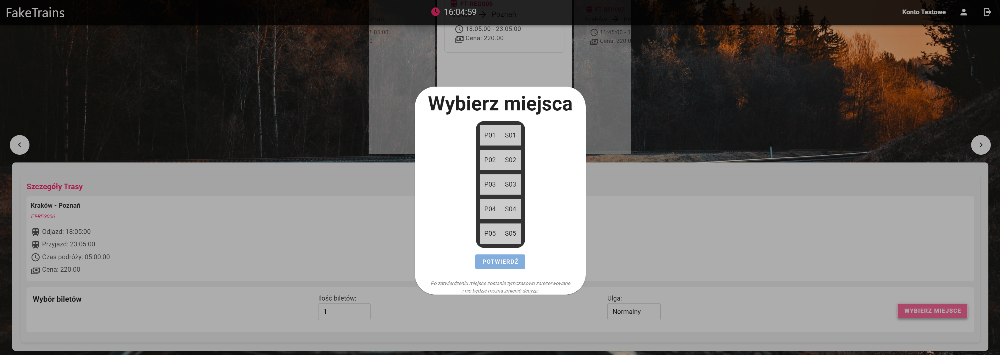
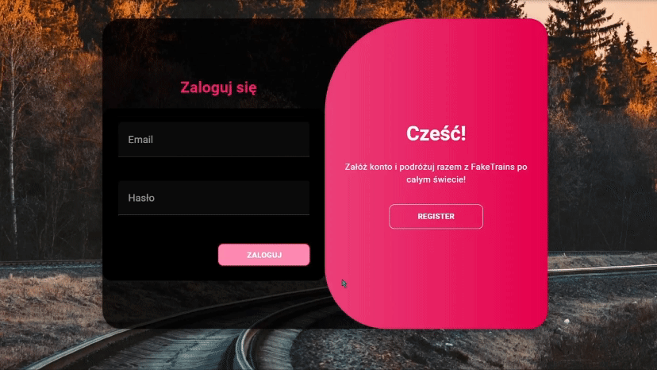

# Faketrains

Faketrains is an online platform created for searching train connections and purchasing tickets. The platform allows users to select optimal routes with possible transfers based on a dedicated algorithm.

## Basic Information

***! To complete a transaction successfully, you must be logged in !***

### Test Payment Data

- Card number: `4242 4242 4242 4242`
- Expiry date: `12/34`
- CVV: `567`
- Name: any
- Email: any

### Test Account Data on FakeTrains

- Email: `test@test.pl`
- Password: `FTtest123`

## Availability

The project is available online at: [faketrains.mwalas.pl](http://faketrains.mwalas.pl)

## Screenshots

  
  

## Key Features

- **Train Connection Search**: The platform enables searching for train routes, also offering optional transfers.
- **Registration and Login**: Users can register and log in, allowing full use of the platform's capabilities.
- **Automatic Ticket Reservation**: Upon selecting a seat on the train layout, the ticket is automatically reserved for 2 minutes, providing time to complete the transaction. If the transaction is not completed, the reservation expires, and the seat becomes available again.
- **Ticket Purchase**: Tickets can be purchased through the Stripe payment system. This operation can only be performed by logged-in users.

## Technologies Used

- **Backend**: Python and the Django framework.
- **Frontend**: Vue.js.
- **Database**: Django ORM for data management.
- **Docker**: The application runs in Docker containers, ensuring easy deployment and scaling.
- **CI/CD**: Using GitHub Actions for automatic deployment (autodeploy).

## Additional Information

The project was developed as part of a university course. The main goal was to create a useful platform for users looking for optimal train routes, with easily accessible ticket purchase options. All data presented in the application, including timetables and seat availability, were manually prepared, demonstrating the functionality of the system.
